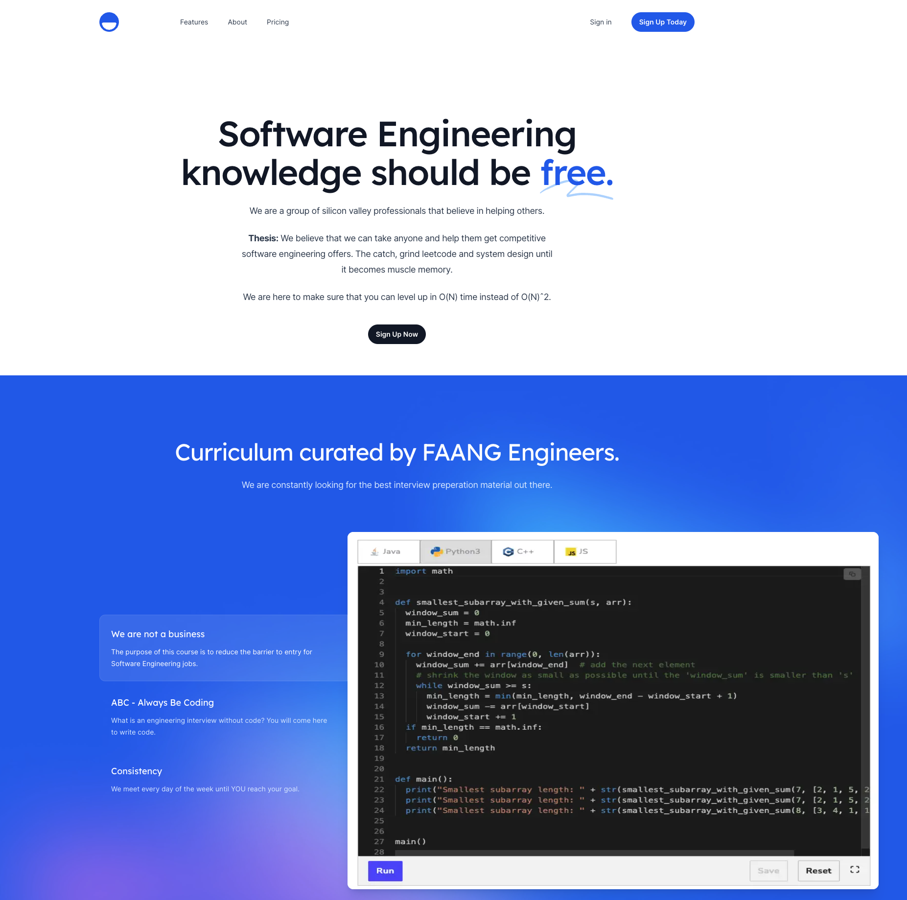

<h1 align="center">Code Elevate</h1>

<p align="center">
  This repository contains the original Cheetcodes website. Let's use it to create a Code Elevate landing page.
</p>

<p align="center">  </p>


---

<div align="center">
  <h3>
    <a href="#-Quickstart">
      Quickstart
    </a>
    <span> | </span>
    <a href="#-Tech-Stack">
      Tech stack
    </a>
    <span> | </span>
    <a href="#-Tutorials">
      Tutorials
    </a>
  </h3>
</div>

<br />


# ✍️ Quickstart


```bash
npm install
```

Next, run the development server:

```bash
npm run dev
```

Finally, open [http://localhost:3000](http://localhost:3000) in your browser to view the website.


# 👨‍💻 Tech Stack

Here's a brief high-level overview of the tech stack used.

- [Tailwind CSS](https://tailwindcss.com/docs) - the official Tailwind CSS documentation
- [Next.js](https://nextjs.org/docs) - the official Next.js documentation
- [Headless UI](https://headlessui.dev) - the official Headless UI documentation

# 🌟 Tutorials  
- https://www.youtube.com/watch?v=gSpPtHSELfY 


# 💛

Reminder that *you are great, you are enough, and your presence is valued.* 